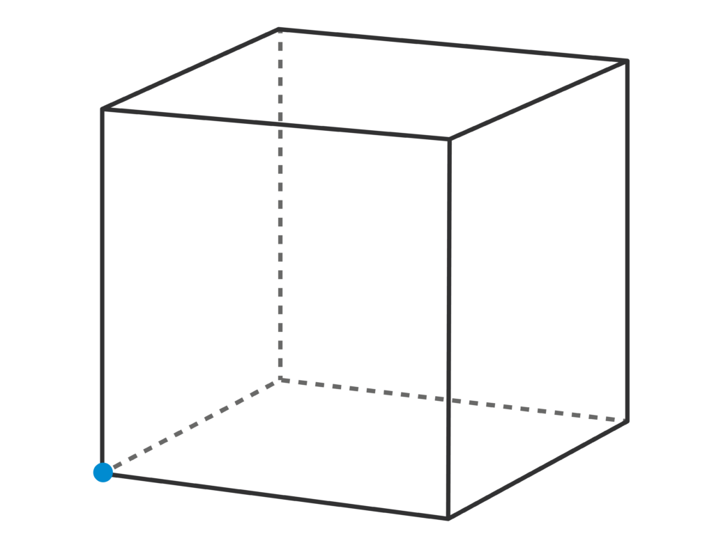
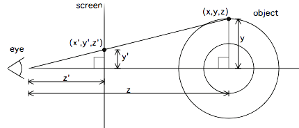

<div style="display: flex; justify-content: center; align-items: center;">
    
    
</div>

<div style="display: flex; justify-content: center; align-items: center;">
    <h1>Spinning Cube</h1>
</div>

In the vast universe of geometric shapes and the fascinating visual representations of mathematics, the "donut" math concept, popularized by the engineer [A1k0n](https://www.a1k0n.net/), has made a lasting impression on the field of 3D visualization and its projections onto 2D. This idea, based on a torus, a topological figure whose symmetry and intrinsic complexity have captivated both mathematicians and artists, inspired me to take it a step further and reinterpret it in three dimensions with a cube as the base, creating an entirely new visualization with my personal touch, and of course, programmed from scratch.

Instead of projecting a complex shape like a torus onto a 2D plane, as in the original case, I decided to apply the same mathematical essence but using a cube as the reference object. The cube, one of the simplest and most fundamental shapes in three-dimensional geometry, becomes the canvas for an equally fascinating projection. The idea is to construct a kind of "cube donut" that, like the original, can be projected onto 2D while maintaining the complexities of its three-dimensional structure.

### How Does It Work?

The key to this project lies in how we take a three-dimensional shape (in this case, the cube) and project its features and shadows onto a two-dimensional plane. This process isn't as simple as taking an image of the cube and transforming it; the essence of the project is in the mathematical projections that simulate how the cube would appear from different angles, manipulating its vertices and surfaces according to a 3D coordinate system.

</img>

The cube, by nature, has 6 faces, 12 edges, and 8 vertices. To bring it into the "donut-like" visualization world, I used a combination of rotational and projective transformations to give the illusion that the cube is spinning on itself, creating a visual effect where the projections of its faces appear and disappear in a way very similar to how a torus rotates in space.

$$
R_x(\theta) = \begin{pmatrix}
1 & 0 & 0 \\ 
0 & \cos(\theta) & -\sin(\theta) \\ 
0 & \sin(\theta) & \cos(\theta)
\end{pmatrix}
$$

$$
R_y(\theta) = \begin{pmatrix}
\cos(\theta) & 0 \sin(\theta) & \sin(\theta)\\ 
0 & 1 & 0 \\ 
-\sin(\theta) & 0 & \cos(\theta)
\end{pmatrix}
$$

$$
R_z(\theta) = \begin{pmatrix}
\cos(\theta) & -\sin(\theta) & 0 \\ 
\sin(\theta) & \cos(\theta) & 0 \\ 
0 & 0 & 1
\end{pmatrix}
$$

Through a simple yet powerful mathematics, the coordinates of each vertex of the cube are calculated based on its movement in 3D space and how these movements affect the appearance of the edges and surfaces when projected onto 2D. This creates a unique visual spectacle, a geometric choreography of shapes that seem to flow and merge into each other while maintaining their three-dimensional coherence.



This project was built from scratch, without relying on high-level 3D graphics libraries. Everything was programmed in a simple environment using direct calculations of linear transformations and simple projections. The key part of the implementation lies in the ability to apply rotations across the three axes of the cube, and then perform a projection of those positions onto a 2D plane.

```c
                           // $$$$$$$$$$$$$$$$$$$$$$$$$$$$$$$$$$$$$$$$$$$$$$$$$$$$$$$$$$$$$+
                       // $$$$$$$$$$$$$$$$$$$$$$$$$$$$$$$$$$$$$$$$$$$$$$$$$$$$$$$$$$$$$$$+++
                   // $$$$$$$$$$$$$$$$$$$$$$$$$$$$$$$$$$$$$$$$$$$$$$$$$$$$$$$$$$$$$$$$$+++++
               // $$$$$$$$$$$$$$$$$$$$$$$$$$$$$$$$$$$$$$$$$$$$$$$$$$$$$$$$$$$$$$$$$$$+++++++
           // $$$$$$$$$$$$$$$$$$$$$$$$$$$$$$$$$$$$$$$$$$$$$$$$$$$$$$$$$$$$$$$$$$$$$+++++++++
           int main(void) { reset_buffs(); Point vertices[CUBE_VERTICES] = { {-cube//+++++++
           _width / 2, -cube_width / 2, -cube_width / 2}, {cube_width / 2, -cube_w//++++++++
           idth / 2, -cube_width / 2}, {cube_width / 2, cube_width / 2, -cube_width//+++++++
            / 2}, {-cube_width / 2, cube_width / 2, -cube_width / 2}, {-cube_width//++++++++
           / 2, -cube_width / 2, cube_width / 2}, {cube_width / 2, -cube_width / 2,//+++++++
            cube_width / 2}, {cube_width / 2, cube_width / 2, cube_width / 2}, {-c//++++++++
           ube_width / 2, cube_width / 2, cube_width / 2} }; Point center_point = {//+++++++
            0, 0, cube_dst }; Point cam_point = { 0, 0, 0 }; for (int i = 0; i < CU//+++++++
           BE_VERTICES; i++) vertices[i].z += cube_dst; int faces[CUBE_FACES][4] =//++++++++
           { {0, 1, 2, 3}, {4, 5, 6, 7}, {0, 3, 7, 4}, {1, 2, 6, 5}, {0, 1, 5, 4}//+++++++++
           , {3, 2, 6, 7} }; int num_points = 50; int total_points = num_points * n//+++++++
           um_points * CUBE_FACES; Point* cube_points = generate_cube_points(vertic//+++++++
           es, faces, num_points); double A = 0, B = 0, C = 0; while (1) { for (int//+++++++
            i = 0; i < total_points; i++) { Point* rotated = rotate_XYZ(&cube_point//+++++++
           s[i], A, B, C, &center_point); cube_points[i] = *rotated; free(rotated);//+++++++
           } printf("\033[2J"); reset_buffs(); for (int i = 0; i < total_points; i+//+++++++
           +) { Point* proj = project_xyz(&cube_points[i], &cam_point); int screen_//+++++++
           x = (int)(proj->x) + WIDTH / 2; int screen_y = (int)(proj->y) + HEIGHT//+++++++++
           / 2; if (screen_x >= 0 && screen_x < WIDTH && screen_y >= 0 && screen_y//++++++++
           < HEIGHT) { if (proj->z < z_buff[screen_y][screen_x]) { z_buff[screen_y]//++++++
           [screen_x] = proj->z; screen_buffer[screen_y][screen_x] = get_char(i, to//+++++
           tal_points); } } free(proj); } for (int i = 0; i < HEIGHT; i++) { for (i//++++
           nt j = 0; j < WIDTH; j++) putchar(screen_buffer[i][j]); putchar('\n'); }//+++
            A = mod(A + 0.001, 2 * PI); B = mod(B + 0.001, 2 * PI); C = mod(C + 0.0//++
           01, 2 * PI); usleep(40000); } free(cube_points); return 0; } /* ----- *///+
```

This project, though inspired by the famous "math donut," is an evolution of the original idea, exploring new ways to manipulate three-dimensional figures through simple yet powerful mathematical calculations. In the end, both the cube and the donut, while very different in shape, share a common essence: they are manifestations of pure mathematics, transfigured through visualization and creativity. In this sense, it doesn't matter whether what you have in front of you is a cube or a donut; what matters is how the human mind, armed with the right tools, can transform and visualize the very nature of shapes.

